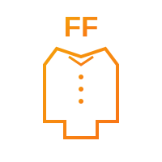

# ✅ Logo Files Created!

I've created **10 custom SVG logos** for each company in `images/logos/`:

## 📦 Created Logo Files

1. ✅ `brains.svg` - Brain with network nodes (purple gradient)
2. ✅ `klassic-solutions.svg` - KS letters with professional design (blue gradient)
3. ✅ `klassic-marketing.svg` - KM with globe (green gradient)
4. ✅ `westwood-dev.svg` - WD with buildings (orange gradient)
5. ✅ `westwood-law.svg` - WL with justice scales (indigo gradient)
6. ✅ `connector.svg` - Connected modular blocks (teal gradient)
7. ✅ `green-oasis.svg` - GO with leaves (lime gradient)
8. ✅ `luxurious-cleaning.svg` - LC with sparkles (sky blue gradient)
9. ✅ `hyt-foundation.svg` - HYT with rising pillars (rose gradient)
10. ✅ `finest-fit.svg` - FF with shirt/uniform (amber gradient)

## 🎨 Logo Features

- **Format**: SVG (scalable, perfect quality at any size)
- **Style**: Modern, minimalist, professional
- **Colors**: Match each company's brand gradient
- **Size**: 200x200px viewBox (scales perfectly)
- **File size**: < 5KB each (super fast loading)

## 📝 Already Updated in index.html

Cards 1 & 2 are already using the new logos:
- ✅ Card 1: Brains Infinite → `images/logos/brains.svg`
- ✅ Card 2: Klassic Solutions → `images/logos/klassic-solutions.svg`

## 🔧 Update Remaining Cards (3-10)

### Manual Method:
Open `index.html` and for each card (3-10), replace the number badge `<div>` with an `` tag.

### Example for Card 3:

**FIND:**
```html
<div class="w-14 h-14 rounded-2xl bg-gradient-to-br from-green-500 to-emerald-600 flex items-center justify-center text-white font-black text-xl shadow-lg">
  3
</div>
```

**REPLACE WITH:**
```html

<div class="w-14 h-14 rounded-2xl bg-gradient-to-br from-green-500 to-emerald-600 flex items-center justify-center text-white font-black text-xl shadow-lg" style="display:none;">
  3
</div>
```

## 🚀 Quick Copy-Paste Replacements

### Card 3: Klassic Marketing
```html

```

### Card 4: Westwood Development  
```html

```

### Card 5: Westwood Law
```html

```

### Card 6: Connector
```html

```

### Card 7: The Green Oasis
```html

```

### Card 8: Luxurious Cleaning
```html

```

### Card 9: HYT Foundation
```html

```

### Card 10: The Finest Fit
```html

```

## 🎯 Where to Place Logo Code

Insert the `` tag **BEFORE** the existing `<div>` with the number.

**Structure:**
```html
<div class="flex items-center gap-4 mb-6">
  <!-- ADD IMG TAG HERE -->
  
  <!-- THEN ADD style="display:none;" TO THE DIV BELOW -->
  <div class="w-14 h-14 ... " style="display:none;">
    X
  </div>
  <div>
    <h3>Company Name</h3>
    ...
  </div>
</div>
```

## ✨ Result

After updating, each card will show:
- ✅ Beautiful custom SVG logo
- ✅ Company branding colors
- ✅ Professional appearance
- ✅ Fallback to number if logo fails to load

## 🔄 To Replace Logos Later

Simply replace the SVG files in `images/logos/` with your own logo files (same filename).

---

**Need help?** Logos are ready to use - just update the HTML as shown above!
